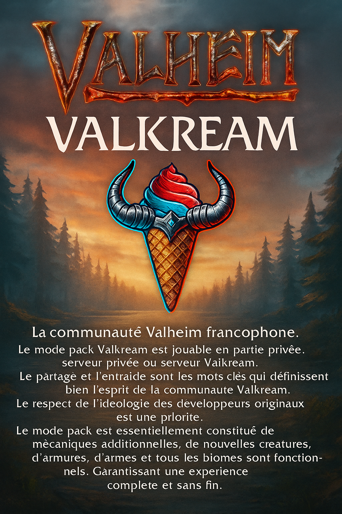

# Valkream ModPack

Bienvenue sur le ModPack **Valkream** !  
Ce modpack est conçu pour enrichir votre expérience de jeu sur Valheim avec de nombreux mods, configurations et contenus personnalisés.

## Sommaire

- [Présentation](#présentation)
- [Installation](#installation)
- [Contenu du ModPack](#contenu-du-modpack)
- [Configuration](#configuration)
- [Crédits](#crédits)
- [Support](#support)

---

## Présentation

Valkream ModPack rassemble une sélection de mods pour améliorer, équilibrer et diversifier le gameplay de Valheim. Il inclut des modifications de gameplay, de nouveaux objets, des configurations personnalisées, des traductions, et bien plus encore.

## Installation

1. Téléchargez le fichier `build.zip` depuis ce dépôt.
2. Extrayez le contenu de l'archive dans le dossier de votre jeu Valheim.
3. Assurez-vous d'avoir installé BepInEx (mod loader pour Valheim).
4. Copiez les fichiers de configuration du dossier `src/config/` dans le dossier `BepInEx/config/` de votre installation Valheim.
5. Lancez le jeu et profitez !

## Contenu du ModPack

- **Mods** : Plus de 100 mods configurés pour une expérience optimale.
- **Configs personnalisées** : Tous les fichiers de configuration sont dans `src/config/`.
- **Traductions** : Dossiers de traductions pour plusieurs mods dans `src/config/TherzieTranslations/`.
- **Images et assets** : Logos, fonds, icônes, etc. dans les dossiers correspondants.
- **Scripts** : Un script de build (`build-script.js`) pour automatiser la création du modpack.

## Configuration

Vous pouvez personnaliser les mods en éditant les fichiers dans `src/config/`.  
Pour chaque mod, un fichier de configuration dédié est disponible.  
Des exemples de configurations et de sauvegardes sont également fournis.

## Crédits

- Merci à tous les créateurs de mods utilisés dans ce pack.
- Merci à la communauté Valheim pour son soutien et ses retours.

## Support

Pour toute question, suggestion ou bug, merci d'ouvrir une issue sur ce dépôt ou de contacter l'équipe Valkream.

---

Bon jeu !
